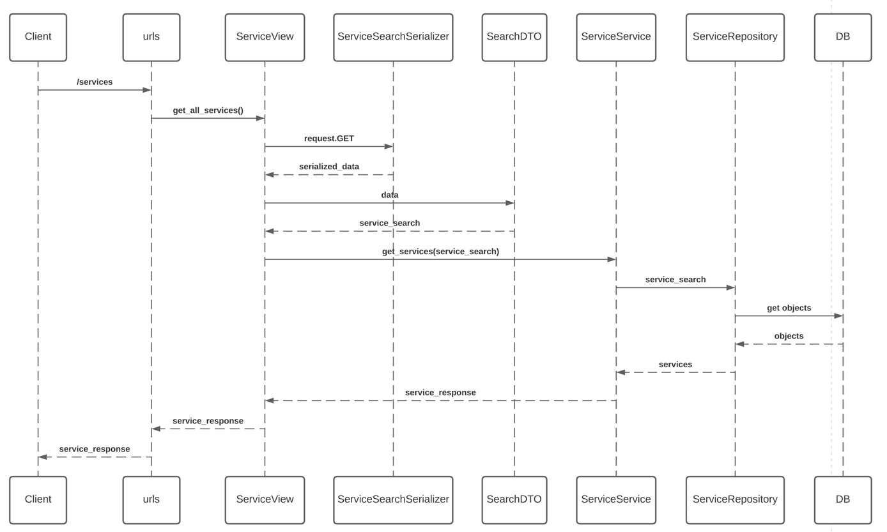

## Code Structure
```buildoutcfg
.
|
├── geos_hub_be                 # Main Django application
│   ├── settings.py
│   └── urls.py
|
├── service_management                      # Application for Geo's Hub services
│   ├── views                           # To handle client request
│   ├── serializers                     # To verify request data
│   ├── dtos                            # Standarize input data
│   ├── services                        # Service layer
│   ├── repositories                    # DB layer
│   ├── migrations
│   └── models.py
|
├── customer_management                     # Application for Geo's Hub customer
│   ├── views
│   ├── migrations
│   └── models.py
|
├── tests                                   # Unit Test
|
├── db.sqlite3                  # Testing databse
├── README.md
├── documents
├── manage.py
├── requirements.txt            # Required package for project
└── venv                        # Virtual environment
```

## Architecture
### ERD


### Component Diagram


### Sequence Diagram
- Get Service Flow 


## Local Setup
### Installations
- Install python >= 3.7
- Clone repository
```buildoutcfg
git clone 
```
- Create virtual environment
```buildoutcfg
cd geos-hub-be/
python -m install venv venv
```
- Install required packages
```buildoutcfg
pip install -r requirements.txt
```
- Migrate database
```buildoutcfg
python manage.py migrate
```

### Running
- Run the service locally
```buildoutcfg
python manage.py runserver localhost:8001
```

### Testing
Run Unit Test and Coverage
```buildoutcfg
pytest --cov=service_management tests/ --cov-fail-under=90
```

View the coverage details
```buildoutcfg
coverage html
```

Check linting
```buildoutcfg
flake8 --ignore E501 tests/ service_management/ customer_management/

```

### CURL test
- Search and sort service by name/price/os_platform/description with page_size
```buildoutcfg
curl --location --request GET 'http://localhost:8001/services?search_by=os_platform&search_value=o&sort_by=os_platform&page_size=3'
```
