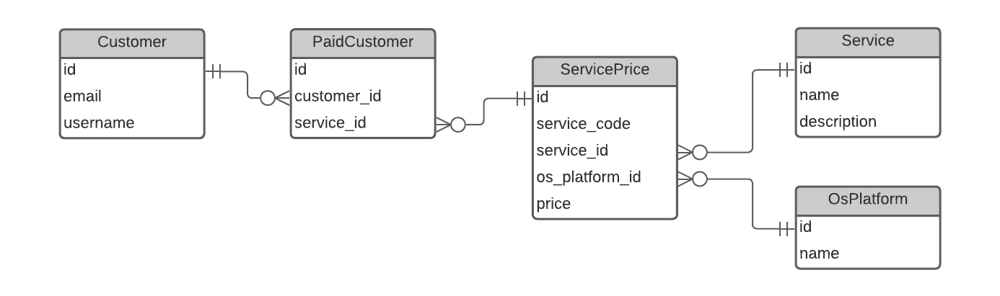
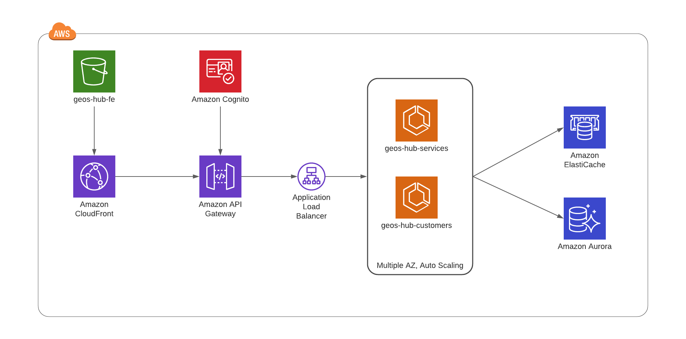

## Code Structure
```buildoutcfg
.
├── README.md
├── manage.py
|
├── geos_hub_be                 # Main Django application
│   ├── settings.py
│   └── urls.py
|
├── customer                    # Application for customer management 
│   ├── migrations
│   ├── models.py
│   └── views.py
|
├── services                    # Application for service management
│   ├── migrations
│   ├── models.py
│   └── views.py
|
├── tests
|
├── db.sqlite3                  # Testing databse
├── documents
├── requirements.txt            # Required package for project
└── venv                        # Virtual environment
```

## Architecture
### ERD



### Component Diagram


## Local Setup
### Installations
- Install python >= 3.7
- Clone repository
```buildoutcfg
git clone 
```
- Create virtual environment
```buildoutcfg
cd geos-hub-be/
python -m install venv venv
```
- Install required packages
```buildoutcfg
pip install -r requirements.txt
```
- Migrate database
```buildoutcfg
python manage.py migrate
```

### Running
- Run the service locally
```buildoutcfg
python manage.py runserver localhost:<custom_port>
```

### Testing
```buildoutcfg
pytest --cov=service_management tests/
coverage html
```

### CURL test
- Get all services
```buildoutcfg

```
- Research services
```buildoutcfg

```
- Filter services
```buildoutcfg

```
- Sort services
```buildoutcfg

```
- Login/Get paid services
```buildoutcfg

```